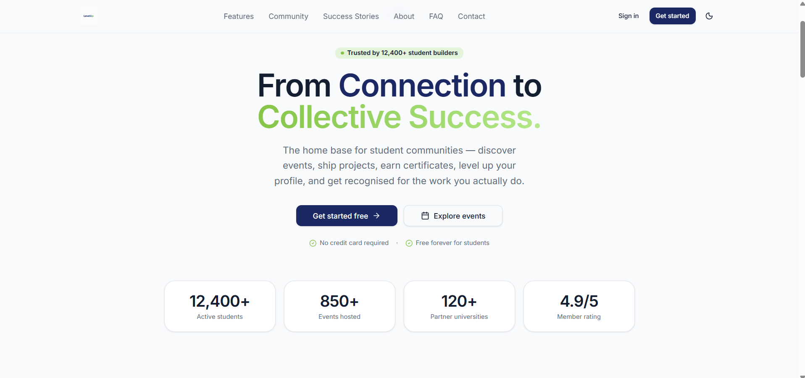
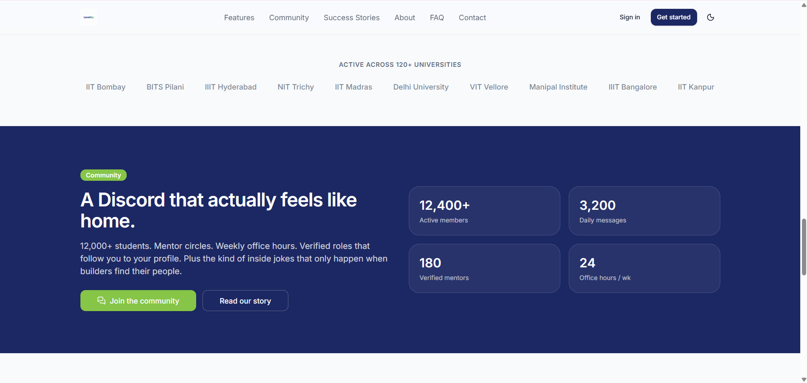
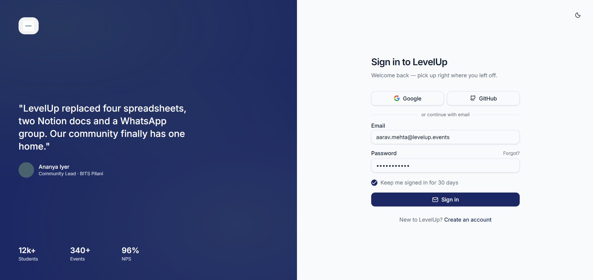
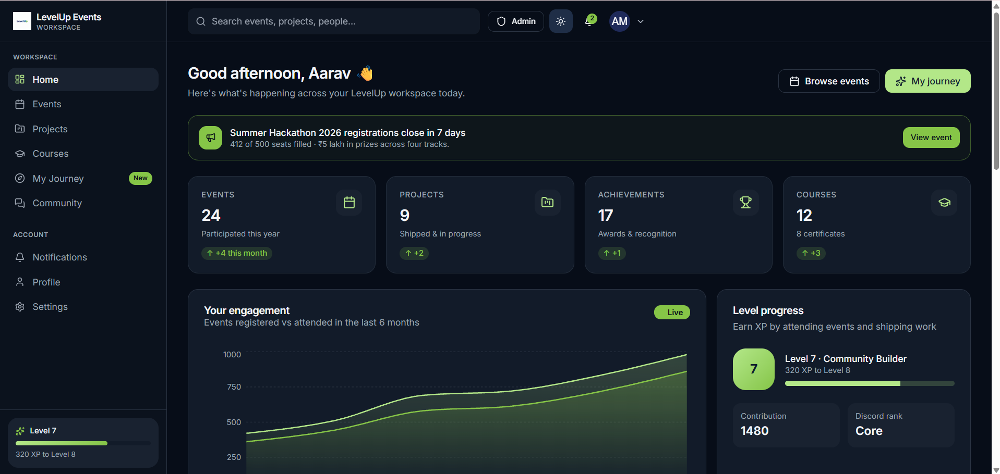
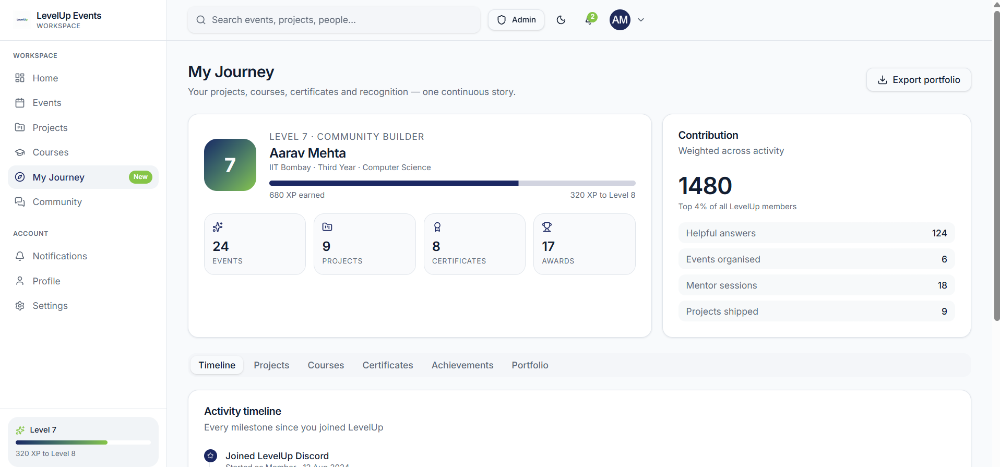
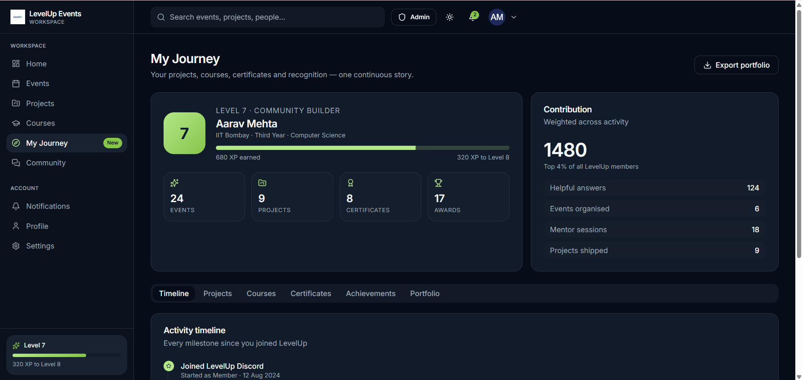
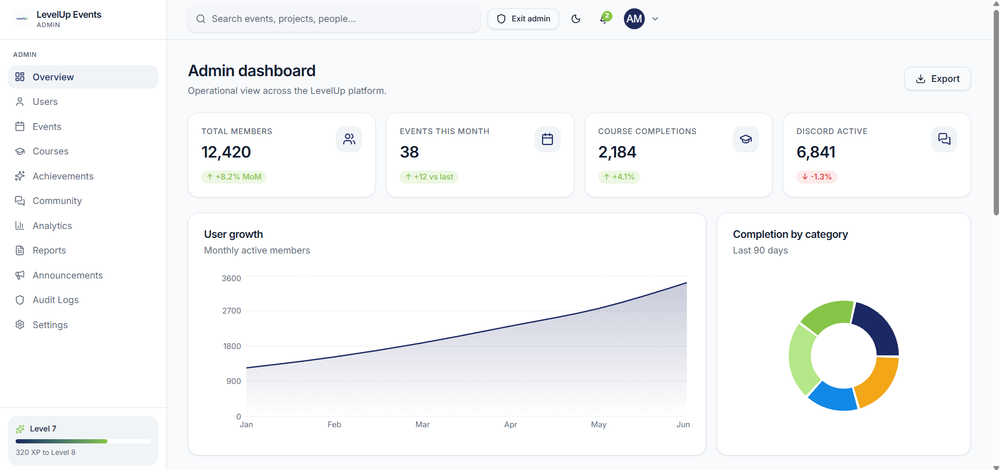

<p align="center">
  
</p>

<h1 align="center">LevelUp</h1>
<p align="center">The all-in-one workspace for student communities — events, learning, projects, achievements and recognition.</p>

## Screenshots

### Homepage


### Community


### Sign in


### Student dashboard


### My Journey — light & dark
Same page, synced theme toggle — one click, every page follows instantly.

<table>
  <tr>
    <td></td>
    <td></td>
  </tr>
</table>

### Admin dashboard


## Tech stack

- [TanStack Start](https://tanstack.com/start) — React 19, server-rendered
- [TanStack Router](https://tanstack.com/router) + [TanStack Query](https://tanstack.com/query)
- Tailwind CSS v4 + [shadcn/ui](https://ui.shadcn.com) (Radix UI primitives)
- react-hook-form + zod for forms and validation
- Recharts for analytics, Sonner for toasts, Lucide for icons

## Status

The frontend is complete — marketing site, auth flows, student workspace, admin dashboard, and a light/dark theme that stays in sync across tabs. It currently runs on local mock data (see `src/lib/mock-data.ts`) rather than a live backend, so nothing persists yet — that's the next step.

## Getting started

```bash
npm install
npm run dev
```

Then open the local URL printed in the terminal.

```bash
npm run build     # production build
npm run preview   # serve the production build locally
```
